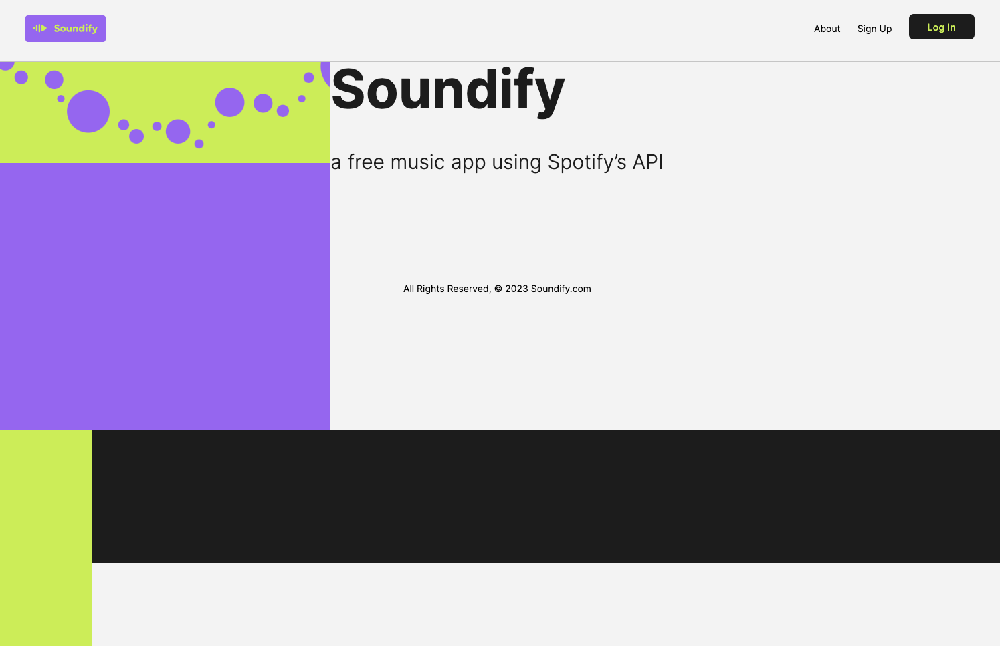
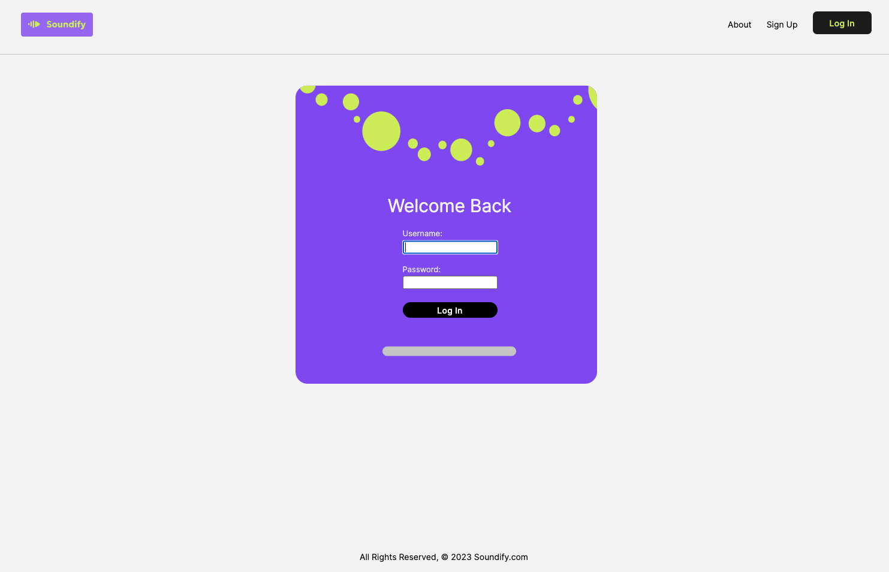
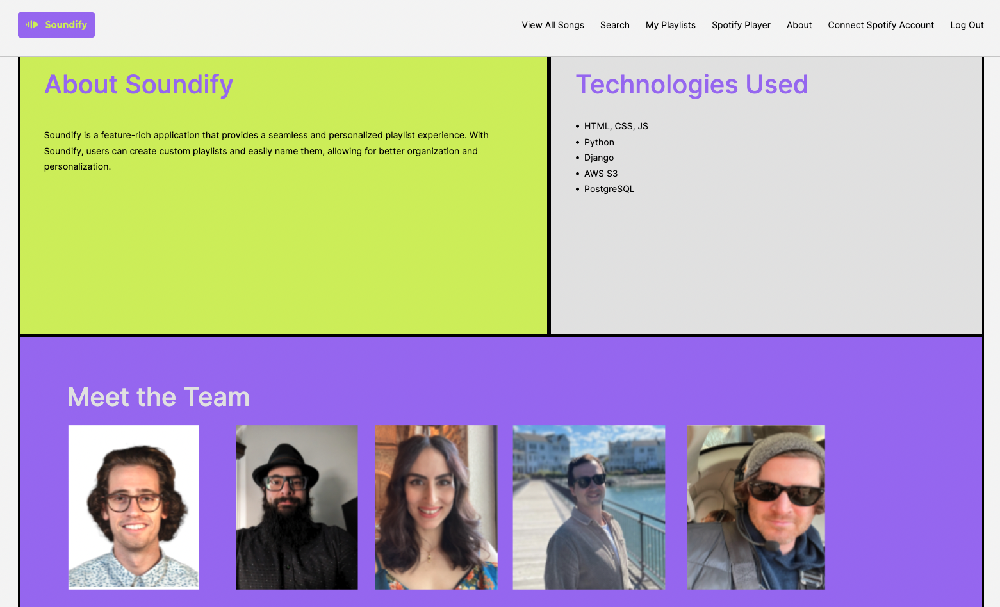

# Soundify

Screenshots

  
  
  

Soundify - Turn on the sound

Music is the one thing on this planet that brings people together. Over 616 million peole worldwide subscribe to a music streaming service to discover new music and listen to their favorite artists. Music streaming service subscribers have increased 28 times over in the last decade. 

Soundify is a music application that allows the user to have more control of their playlists increasing functionality and user experience. 
Soundify prioritizes user convenience by enabling a powerful search functionality allowing users to quickly add or delete songs to their playlists.
Soundify allows users to tailor their playlists to bring their music preferences to life. 

Soundify 
    - Users can create a playlist and name it
    - Users can click on a detail view of a playlist to see what songs whats are inside that playlist
    - Users are able to add many songs to one or many playlists
    - Users are able to click on a details of a song and view the information regarding the song and artist 
    - Users are able to search through songs and add them playlists
    - Users are able to delete songs from their playlist
    - Users are able to delete playlists which will delete songs within that particular playlist

Soundify's utilities are well tested and continuously maintained. Every contribution to the repository is checked for quality and maintained to the highest degree of excellence. 

Users will log in to their account that the user has created to ensure privacy informtion is protected.

Technologies used:

  - Python
  - Django
  - HTML
  - CSS
  - JS
  - Spotify API
  - PostgreSQL
  - AWS S3
  - GitHub
  - Trello
  - Figma
  - Google pitchdeck slides

Getting Started:
  [Click to View Project Planning](https://trello.com/b/tzhmkpLU/project-3-soundify)
  [Click to go to Soundify](https://soundify-ahje.onrender.com/)

Next Steps:
  - Customize the playlist to show which song is being
    played while being highlighted or show a speaker beside the track
  - Add the ability to see other users playlists
  - Share songs with other users
  - Share playlists with other users

